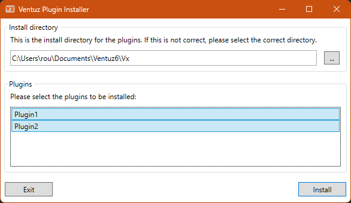

# Ventuz Plugin Installer

This is a little tool that will install VX plugins into the Ventuz Plugins directory. It's really not more than a user-friendly interface that copies files to a certain destination, but when delivering Ventuz projects to clients, this is the comfort they need.

## Preparation

When maintaining a Ventuz project, you'd usually store all required files within one directory that you deliver to your client. It doesn't matter whether you prefer VPR releases or distribute open projects, you'll have your directory structure and you'd usually include any VX plugins. One place to store them is the Modules folder. So let's assume a structure like this (simplified):

```
Project
|- Data
  |- settings.json
|- Modules
  |- Plugin1.zip
  |- Plugin2
    |- Plugin2.vx.dll
|- Project.vpr
```

Here we've got a sample project with some settings and two plugins in the Modules folder. As you can see the first plugin has been zipped, the second is the full plugin folder. These two options are supported.

We'll add the Installer to the Modules folder:

```
Project
|- Modules
  |- Plugin1.zip
  |- Plugin2
    |- Plugin2.vx.dll
  |- VXInstaller.exe
```

The installer will check its working directory for zip files and folders that contain files with the ending `.vx.dll`. Each occurence will be interpreted as a plugin.

## Usage

Once the installer and the plugins have been placed correctly, the installer can be executed. It should open a window that looks like this:



The application finds the user's documents folder and adds the part to the VX folder. If that's wrong for some reason, the button on the right allows the user to select a differnt folder.

The application also shows a list of all plugins it has found. They are all pre-selected. The user can change the selection by clicking the items in the list.

Finally, a click on install will attempt to install all selected plugins to the given destination.
